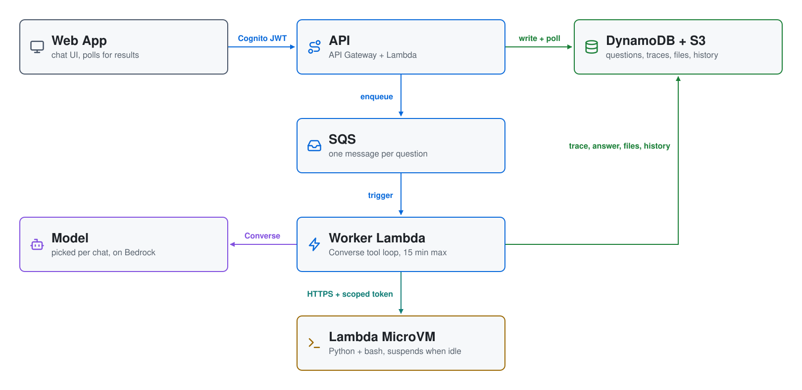

# MicroVM Agent Sandbox (`aws-microvm-agent-sandbox`)

A chat app whose agent has its own **AWS Lambda MicroVM** to run code in.

It offers **Claude Haiku 4.5** (the default) and **Claude Sonnet 4.6**. With
either, the agent also **looks at the image it rendered** and fixes anything
wrong before answering.

Ask *"Build me a fractal tree and get me the results"*. The agent writes code,
runs it in a private Firecracker VM, and puts the picture in the chat. You
watch each step **live** while it works: the sandbox launching, the code it
ran, the output, and the file it showed. When the answer arrives, the steps
fold into a **Reasoning** bar above it, with the tool count, tokens and
elapsed time.

It is the same demo as the Claude/ChatGPT MCP connector in
[aws-lambda-microvms](https://github.com/mamonaco1973/aws-lambda-microvms). The
difference is where the agent lives: here it runs inside your own app, as a
Bedrock tool loop you can read end to end.

---

## What it showcases

1. **A MicroVM as an agent sandbox.** Each conversation gets its own VM, with
   its own kernel, filesystem and endpoint. Model-written code runs there and
   never in your Lambda.
2. **Launch on demand.** Creating a chat launches nothing. The VM starts the
   first time the agent runs code. Launching restores a snapshot with Python,
   numpy and matplotlib already loaded in memory, so it takes seconds.
3. **State that survives.** The VM runs two persistent sessions, Python and
   bash, over one shared filesystem. Variables, imports, the shell's `cd` and
   exports, and files all persist between messages. After 30 idle minutes
   the VM suspends and costs nothing for compute. The next message wakes it
   with both sessions intact.
4. **Context that carries over.** Each new message replays the earlier ones
   *with their tool calls*, so the agent remembers what it ran and what went
   wrong, not just what it said. It also gets an inventory of the sandbox
   (files, Python functions and data, the shell's `cwd`) taken when the last
   message finished, so it reuses what's there instead of rebuilding it.
   On models with Bedrock prompt caching, the replay is cheap.
5. **An agent that checks its work.** On models with image input,
   `show_file` sends the rendered PNG back to the model, which reviews what it
   drew and re-renders if something is off.
6. **More than one model.** Claude Haiku 4.5 and Claude Sonnet 4.6 are offered
   side by side, chosen per conversation.

## Architecture

<picture>
  <source media="(prefers-color-scheme: dark)" srcset="architecture-dark.svg">
  
</picture>

Only CloudFront and the frontend bucket are left out; Cognito is the label on
the browser's hop. Regenerate with `python make_diagram.py`.

**The tool loop** (`02-core/code/worker.py`) calls Bedrock **Converse** with
four tools and runs each tool the model asks for:

| Tool | What it does |
|---|---|
| `run_code(code)` | Runs Python in the conversation's persistent session and returns the output. The worker waits for the cell, so the model never polls. |
| `run_shell(command)` | Runs bash in the conversation's persistent shell: `cd`, exports and variables carry over between calls. The model uses it for installs (`pip3`, `dnf`), git, files and builds. |
| `get_result(job)` | Keeps waiting on a job that is still running after 4 minutes (for example, a big install). |
| `show_file(path)` | Fetches a file from the VM and stages it in S3 as an attachment on the answer. Images show inline; an HTML file (a game, a page) gets an **Open in a new tab** link; anything else downloads. For a model with image input, an image is also returned to the model so it can check it. Showing the same path again replaces the attachment. |

**The sandbox** (`01-sandbox/image/`) is a MicroVM image built remotely by
Lambda from a Dockerfile, so you need no Docker or ECR. A stdlib HTTP
supervisor accepts cells as jobs: `POST /execute` returns a job id and
`GET /result/<id>` returns the output. Jobs run in one of two persistent
sessions that share `/workspace`: a Python kernel that imported numpy and
matplotlib *before* the snapshot was taken, and a bash shell. A session that
dies (a `set -e` failure, `os._exit()`) restarts itself on the next command,
and the output says what was reset.

**Security boundary:** the VM. The sandbox's IAM role has **no policies**, so
code the model writes can reach the internet (for `pip`) but cannot call a
single AWS API. Files leave the VM only through the worker. An HTML file
opens from its S3 link, a different origin from the app, so a page the model
wrote cannot reach your session.

## Models

`bedrock-config.sh` lists the models offered in the picker, one per line, with
two switches each: **image input** and **prompt caching**. Pick the model when
you start a chat; the first message locks it to that conversation.

| Model | Image input | Prompt caching |
|---|---|---|
| Claude Haiku 4.5 (`us.anthropic.claude-haiku-4-5-20251001-v1:0`) | yes | yes |
| Claude Sonnet 4.6 (`us.anthropic.claude-sonnet-4-6`) | yes | yes |

Default: **Claude Haiku 4.5**. Each model is a us.* or global.* inference
profile, or a bare foundation-model id for models offered on demand only.

`./probe_bedrock.py` lists every model your account can use and tests tool
use, image input and caching with real calls, then prints ready-to-paste
`BEDROCK_MODELS` lines. `check_env.sh` probes every configured model before
each deploy and fails a switch the model cannot honour.

## Deploy

Prerequisites: Linux with AWS CLI v2 recent enough to have `lambda-microvms`,
Terraform ≥ 1.9, Python 3 with pip, `zip`, `jq`, `curl` and `envsubst`. Your
account also needs Bedrock access to every model in `bedrock-config.sh`.
MicroVMs are available in us-east-1, us-east-2, us-west-2, eu-west-1 and
ap-northeast-1.

```bash
./apply.sh      # build the sandbox image, deploy the backend, upload the SPA
./destroy.sh    # terminate every sandbox, then tear everything down
```

`apply.sh` runs three phases:

| Phase | Directory | Creates |
|---|---|---|
| 1 | `01-sandbox` | Source bucket, build role, **the MicroVM image** (takes several minutes) |
| 2 | `02-core` | API Gateway, API + worker Lambdas, boto3 layer, Cognito, SQS, DynamoDB, S3, CloudFront, sandbox role |
| 3 | `03-webapp` | Generated `config.js` and the static SPA, uploaded to S3 |

It finishes with `validate.sh`. That script launches a sandbox directly,
checks that it comes up and runs a line of Python, terminates it, and prints
the app URL.

Optional environment variables: `AWS_AGENTOPS_GOOGLE_CLIENT_ID` / `_SECRET`
(Google sign-in via Cognito) and `AWS_AGENTOPS_CUSTOM_DOMAIN`.

## Try it

Sign in, pick a model, then click a starter or type:

1. **Build me a fractal tree**: the headline demo. Watch the sandbox launch,
   the code run and the image appear.
2. **"Now make it an autumn tree with more depth"**: this reuses the same VM,
   and the earlier function is still defined in the session.
3. Leave it for 30 minutes and ask again. The trace shows *Resuming suspended
   MicroVM… with its Python state intact*.
4. **Build the game Breakout**: the agent writes a single-file HTML game, and
   the answer links to it with **Open breakout.html in a new tab**.
5. **Install R and make a pie chart**: the agent installs R from the shell,
   then charts in R, in the same VM.
6. **pip install pandas and chart data**: `pip3 install` in bash, then the
   chart in Python.
7. **Draw a spirograph**: a parametric curve with a colormap along it.
8. **What is your sandbox?**: the agent inspects its own OS, kernel, CPU and
   memory.

Deleting a conversation terminates its VM. Shift- or Ctrl-click the delete
icon to delete every conversation.

## Cost

| Item | Cost |
|---|---|
| Sandbox while running (0.5 GB / 0.25 vCPU ARM) | ~$0.0315/hour |
| Sandbox while suspended (after 30 idle minutes) | $0 compute |
| Suspend / resume snapshot I/O | $0.0038/GB written, $0.00155/GB read |
| Sandbox image storage | $0.08/GB-month, **one-week minimum per image** |
| Model | Bedrock tokens per query (on image-input models, each image adds ~1–2k input tokens) |

The API, worker, DynamoDB, SQS and S3 are all serverless and scale to zero.
Each sandbox lives for 8 hours at most. Sign-up is self-service, so every new
Cognito user can launch sandboxes. The cost bounds are auto-suspend, the
lifetime cap and the per-user token budget (1M tokens, `TOKEN_LIMIT_DEFAULT` in
`02-core/code/users.py`, counted the same for every model), not the user
list. Run `./destroy.sh` when you are done.

## Layout

```
bedrock-config.sh    The models offered, with their switches, and the default
probe_bedrock.py     Which Bedrock models this account can use, tested live
01-sandbox/          MicroVM image (Terraform + image source)
  image/             Dockerfile, server.py (supervisor), kernel.py (Python), shell.sh (bash)
02-core/             Backend Terraform + Lambda code
  code/              handler / conversations / users / worker / sandbox /
                     memory (history + sandbox inventory) / models (the model list)
03-webapp/           Vanilla-JS SPA (chat, model picker, live trace, inline files)
```
